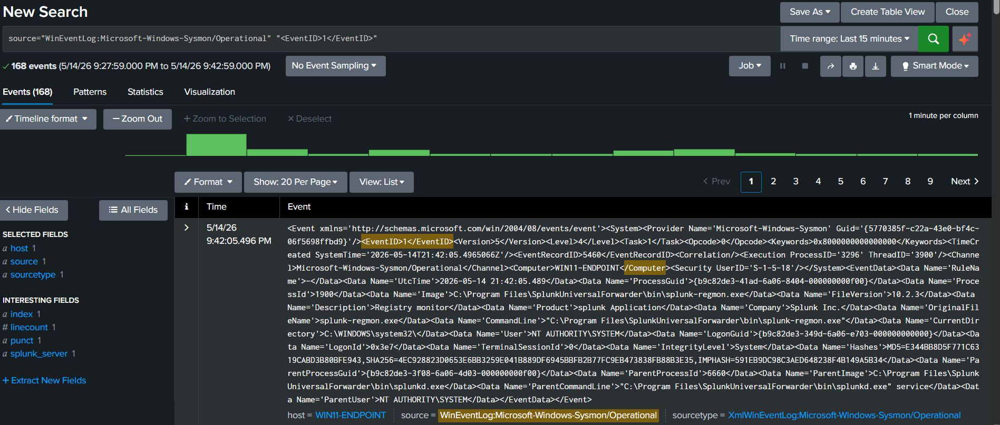
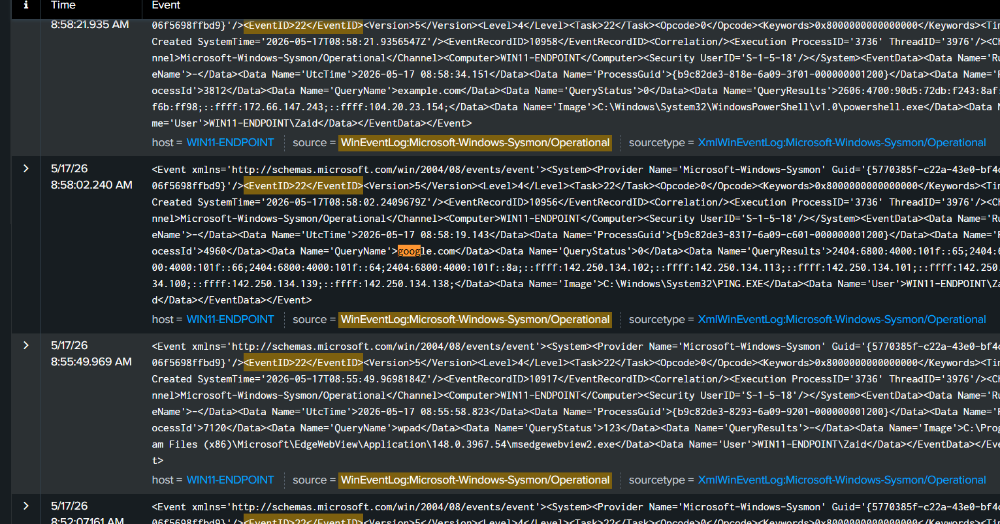
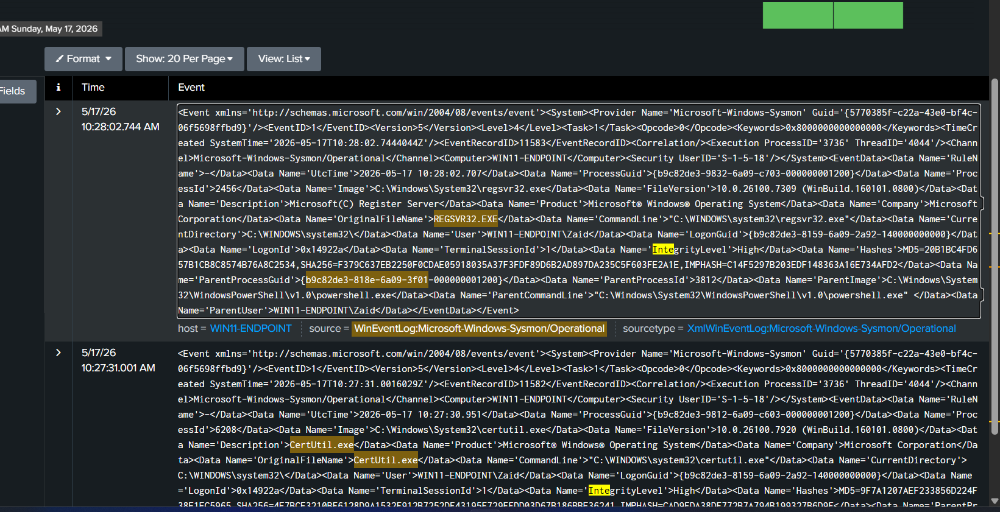
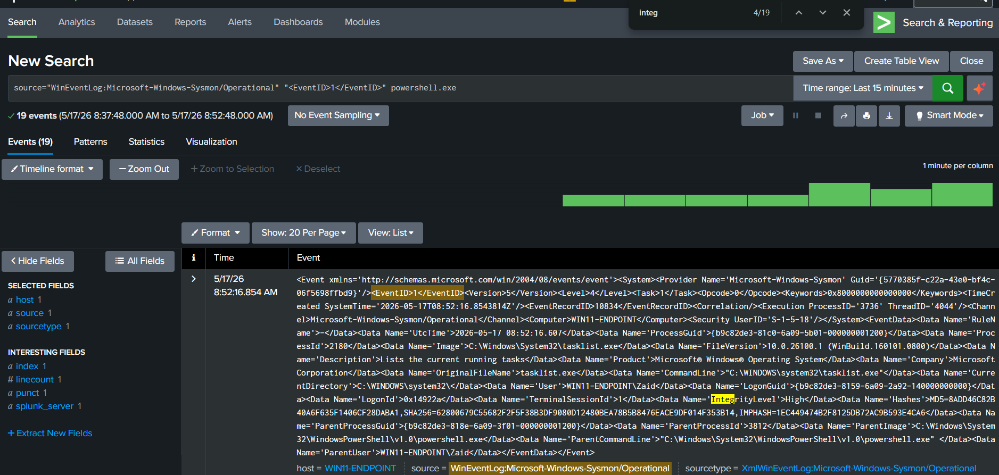

# Splunk + Sysmon Mini SOC Lab

## Overview

This project demonstrates the creation of a functional mini SOC (Security Operations Center) lab using:

- Windows 11 Endpoint
- Sysmon
- Splunk Universal Forwarder
- Splunk Enterprise on Ubuntu Server

The objective of this lab was to simulate attacker-like activity, collect endpoint telemetry, forward logs to a SIEM, and perform basic threat hunting and detection engineering.

---

# Architecture

Windows 11 Endpoint
↓
Sysmon Telemetry
↓
Splunk Universal Forwarder
↓
Splunk Enterprise (Ubuntu Server)

---

# Technologies Used

| Tool | Purpose |
|---|---|
| Sysmon | Advanced Windows event logging |
| Splunk Universal Forwarder | Log forwarding |
| Splunk Enterprise | SIEM platform |
| Ubuntu Server | Splunk hosting |
| Windows 11 | Endpoint telemetry source |

---

# Network Configuration

| Device | IP Address |
|---|---|
| Ubuntu Splunk Server | 192.168.56.102 |
| Windows Endpoint | 192.168.56.105 |

Ports Used:
- 9997 → Log ingestion
- 8000 → Splunk Web UI
- 8089 → Management Port

---

# Sysmon Event IDs Investigated

| Event ID | Description |
|---|---|
| 1 | Process Creation |
| 3 | Network Connections |
| 11 | File Creation |
| 22 | DNS Queries |

---

# Simulated Attacker Activity

The following commands and behaviors were tested:

## Reconnaissance

cmd
whoami
hostname
ipconfig
net user
tasklist

## Encoded PowerShell
powershell -enc SQBlAHgA

## DNS and Network Activity
nslookup google.com
curl https://example.com

## LOLBins
certutil.exe -urlcache -split -f https://example.com test.txt
regsvr32.exe

## Detection Queries

### Encoded PowerShell Detection
source="WinEventLog:Microsoft-Windows-Sysmon/Operational" "-enc"
### LOLBin Detection
source="WinEventLog:Microsoft-Windows-Sysmon/Operational" (certutil.exe OR regsvr32.exe OR rundll32.exe)
### DNS Queries
source="WinEventLog:Microsoft-Windows-Sysmon/Operational" "<EventID>22</EventID>"

## Key Findings
Successfully built a functioning endpoint telemetry pipeline.
Forwarded Sysmon logs from Windows to Splunk Enterprise.
Investigated process creation, DNS queries, network activity, and file creation events.
Simulated attacker-like behavior using PowerShell and LOLBins.
Reconstructed event timelines using Sysmon telemetry.

## Challenges Faced
Sysmon Telemetry Not Ingesting

## Issue:

Sysmon events were not appearing in Splunk.

Root Cause:

Incorrect inputs.conf
Forwarder permission issues

## Fix:

Recreated inputs.conf correctly
Changed SplunkForwarder service account to LocalSystem
Screenshots

## Screenshots

## Process Creation Events (Event ID 1)

---

## DNS Query Telemetry (Event ID 22)

---

## LOLBin Detection

---

## PowerShell Process Telemetry

## Skills Practiced
SIEM Operations
Endpoint Telemetry Analysis
Detection Engineering
Threat Hunting
Sysmon Investigation
SPL Querying
Attack Timeline Reconstruction

## Future Improvements

Sigma rule integration
MITRE ATT&CK mapping
Custom dashboards
Alert creation
Detection tuning
Multi-endpoint monitoring
